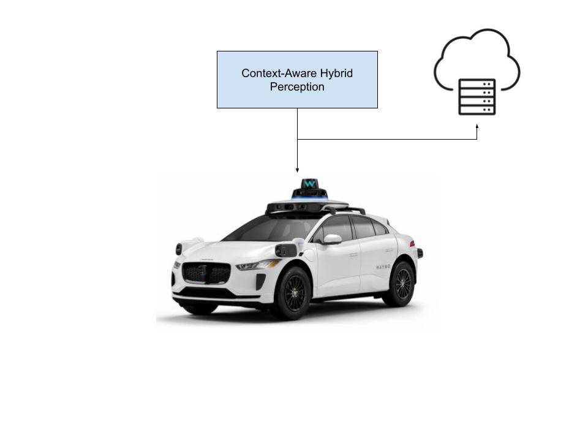
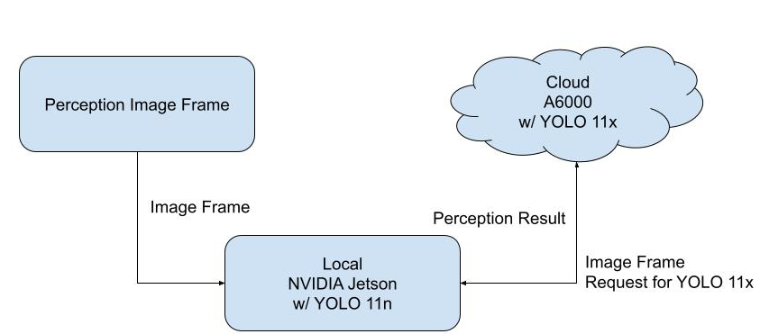
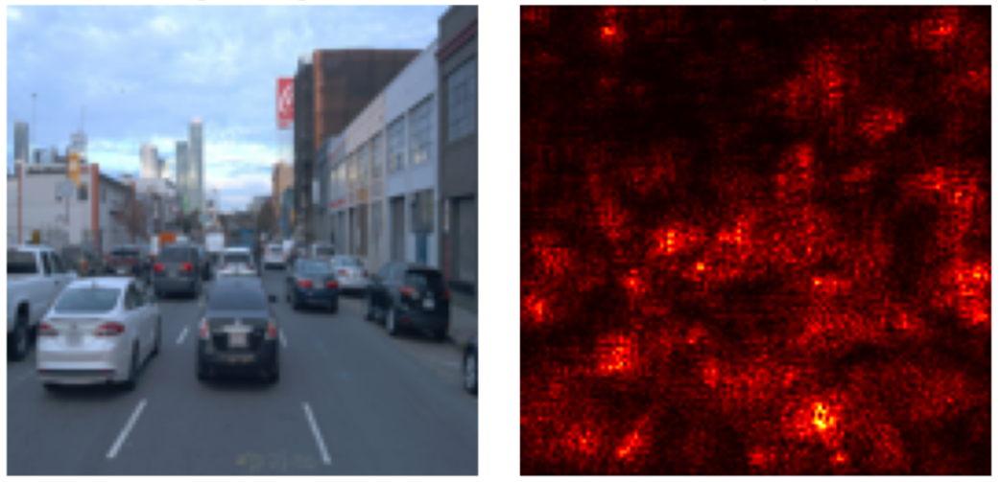
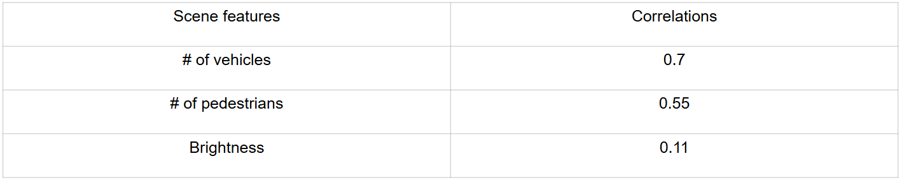
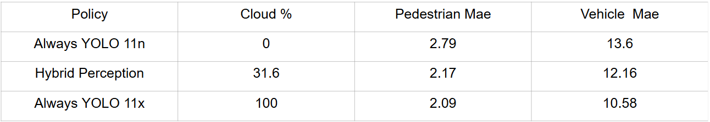
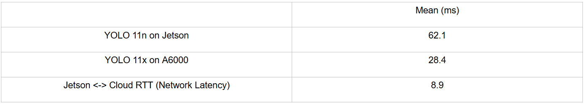

# **Context-Aware Hybrid Object Detection for Autonomous Vehicle Perception**

---

## 👥 **Team**

- Hee Jean Kwon
---

## 📝 **Abstract**

This project presents a context-aware hybrid perception framework for autonomous vehicles that dynamically selects between local and cloud-based object detection to balance latency, accuracy, and resource usage. The system leverages multi-modal contextual inputs—including scene complexity, vehicle state, and network conditions to make real-time offloading decisions using a data-driven model selector. Lightweight local models provide low-latency inference under constrained conditions, while more accurate cloud models are selectively used for complex scenes when network latency permits. Experimental results on the Waymo Perception Dataset demonstrate that the hybrid policy achieves approximately 75% of the accuracy benefits of full cloud offloading while using cloud resources only about one-third of the time. These results demonstrate the feasbility of edge–cloud collaboration for safe and efficient autonomous vehicle perception under constraints.

---

## 📑 **Slides**

- [Midterm Checkpoint Slides](https://github.com/JeanKwon/ECM202A_2025Fall_Project_8/blob/main/docs/assets/Midterm%20Presentation%20.pptx%20(2).pdf)  
- [Final Presentation Slides](https://github.com/JeanKwon/ECM202A_2025Fall_Project_8/blob/main/docs/assets/Final%20Presentation%20.pptx.pdf)

---

# **1. Introduction**

### **1.1 Motivation & Objective**  
It is crucial for autonomous vehciels to detect surrdouning objects quicky and accrautely. Running advanced object detection models entirely on the vehicle reduces dependence on network connectivity but is limited by onboard compute and power budgets. On the other hand, cloud-based processing offers better accuracy but introduces variable network latency and reliability concerns. The objective of this project is to design a perception system that decides, in real time, whether to perform object detection locally or offload it to the cloud based on current driving context and system conditions. By doing so, the system aims to maximize perception accuracy while respecting strict latency and resource constraints. From a systems perspective, hybrid perception enables accuracy-aware cost control by aligning cloud resource usage with perceptual difficulty, avoiding unnecessary expenditure on cloud compute and bandwidth for simple driving scenarios.

### **1.2 State of the Art & Its Limitations**  
Sela et al. propose Octopus, a context-aware streaming perception framework that dynamically switches perception configurations to maximize streaming accuracy rather than conventional offline accuracy [Sela22]. Octopus does a local inference using EfficientDet but dynamically swities the configuration of it using the context of the scenes. While Octopus demonstrates benefits by dynamically selecting models, it focuses on optimizing tracking accuracy within a single execution environment and does not explicitly consider edge–cloud offloading or network variability as part of the decision process. 

On the other hand, Krentsel et al. examine cloud-assisted autonomous driving, arguing that cloud GPUs can execute more accurate perception models faster than onboard hardware when bandwidth is sufficient [Krentsel24]. Their work introduces a bandwidth-aware framework that allocates network resources to maximize service-level utility while meeting strict latency service-level objectives. This approach highlights the feasibility but does not incorporate scene-level difficulty or visual complexity into offloading decisions.

### **1.3 Novelty & Rationale**  
The key novelty of this project is in its context-aware, data-driven model selection policy for hybrid perception. Instead of using predefined rules, the system employs learned decision models that incorporate multi-modal context, including scene complexity, vehicle state, and system/network conditions. A lightweight CNN-based gating model enables rapid scene assessment with minimal overhead, allowing the system to select the most appropriate detection model under a fixed latency budget. This system uses more computing power only when the scene is complex, while handling simpler situations locally, which improves efficiency without reducing safety.

### **1.4 Potential Impact**  
This project could demonstrate a scalable framework for adaptive edge–cloud collaboration under strict real-time constraints. It could reduce operational cloud costs, improve system robustness under variable network conditions, and contribute to safer autonomous driving. The framework is also extensible to other perception tasks and robotic systems beyond autonomous vehicles.

### **1.5 Challenges**  
The project could have several challenges such as designing a decision model that is both accurate and computationally lightweight, handling variability in network conditions in real time, and ensuring that fallback mechanisms preserve safety when issues emerge in cloud system.

### **1.6 Metrics of Success**  
The successs of project is evaludated using the following metrics. 
Perception Accuracy: Reduction in object count error compared to local-only inference.
Cloud Utilization Rate: Percentage of frames offloaded to the cloud relative to total frames processed.
Robustness: System behavior under varying network availability, including correct fallback to local processing.

---

# **2. Related Work**

1. Context-Aware Streaming Perception
Sela et al. propose Octopus, a context-aware perception framework that dynamically selects detection and tracking configurations to maximize streaming accuracy in real-time environments [Sela22]. Their key insight is that higher offline accuracy does not necessarily translate to better performance in streaming settings due to latency-induced ground-truth drift. By using environment features such as object density and motion, Octopus adapts perception configurations on a per-scenario basis and achieves significant gains over static model selection. This work is closely related as it uses the scene context to guide perception decisionns. However, because Octopus operates locally it does not address how additional compute resources in the cloud could be selectively leveraged under real-time constraints.

2. Cloud-Assisted Autonomous Driving
Krentsel et al. study the feasibility of cloud-assisted perception for autonomous driving, arguing that modern cloud GPUs can execute significantly more accurate perception models faster than onboard hardware when sufficient bandwidth is available [Krentsel24]. Their results show that cloud can run detection model 4 to 19 times faster than Jetson orin depends on the perception model. This work strongly motivates the use of cloud resources and directly informs the cost and performance assumptions of this project while deomnstrating the feasbility of cloud assistied driving. However, it allocates cloud resources solely based on bandwidth availability rather than perceptual necessity.

3. Edge-Cloud Collaboration in Autonomous Drivings
Chen et al. propose EC-Drive, an edge–cloud collaborative autonomous driving system that uses small on-vehicle LLMs for routine motion planning while selectively offloading “hard cases” to a cloud LLM when data drift or low-confidence is detected, thereby reducing communication overhead while improving performance on complex scenarios [Chen24]. As it leverages the use of cloud as part of autonomous driving pipeline, it supports the idea of using cloud perception in autonomous vhicles perception. However, this system is driven by condfidence signals rather than considering the complexity of the given scenes.

4. Speed–Accuracy Trade-offs in Vision-Based Perception
Bolya et al. introduce YOLACT, a one-stage framework for real-time instance segmentation that speeds up mask prediction by combining a small set of shared prototype masks with simple per-object coefficients, allowing fast mask generation while maintaining competitive accuracy [Bolya19]. It exemplifies  improving visual understanding typically requires more computation, which can threaten strict latency budgetsm, motivating for perception system. While YOLACT itself focuses on designing a faster single-device model rather than hybrid execution, its demonstrated speed–accuracy trade-offs motivate the use of multiple perception models.

5. Cloud-Assisted Perception for Safety-Critical Autonomous Driving
Schafhalter et al. investigate how autonomous vehicles can safely leverage cloud computing to improve perception and decision accuracy despite unreliable network latency, proposing a speculative execution framework that runs higher-accuracy models in the cloud while always maintaining a local fallback [Schafhalter23]. The authors identify three mechanisms—offloading higher-accuracy models, improving environment representation beyond onboard sensing, and cloud-based contingency planning—that allow cloud computation to enhance safety without compromising real-time guarantees. This paper deploys the idea of having a hybrid perception, similar to what this work is aiming to do. However, the system focuses on providing execution abstractions rather than deciding when cloud inference is perceptually necessary, and it does not explicitly use the frame and system information to guide offloading decisions. 

---

# **3. Technical Approach**

### **3.1 System Architecture**

Figure 1 System overview  
A diagram above illustrates the end-to-end flow. Incoming camera frames are processed in Jetson. Based on the scene compleixty and current network constraints, the system selects either a local YOLO 11n running on Jetson or a more accurate cloud-based YOLO 11x. Then Jetson requests cloud for YOLO 11x execution, and cloud sends the perception result back. 

### **3.2 Data Pipeline**
It is assumed that the RGB camera will provide an image frame that is in JPEG format. The image will be an input to lightweight CNN to decide wheter the scene is complex or not. After considering network condition and scene complexity, if the frame needs to be processed in cloud, Jetson sends over an image frame to cloud as shown in Figure 1. With the received image, the cloud runs a perception and sends back the perception result to the Jetson. 

### **3.3 Algorithm / Model Details**

Figure 2 System Flow 
If it is available, then it checks if the cloud YOLO 11x execution time plus current network latency between Jetson and A6000 is smaller than the max perception latency allowed. Then, using the trained CNN, it checks if the scene is complex. If the frame meets the requirements, then the cloud YOLO 11x is used. If it fails to meet any network condition or the frame is classified to be simple, then local YOLo 11n is used. 

### **3.4 Hardware / Software Implementation**
Hardware:
* Jetson Orin
* A6000
Software Libraries:
* Python 3.8, NumPy 1.24.2, OpenCV 4.6.0, Pillow 9.2.0, ONNX Runtime 1.19.2, YOLO 8.3.230

### **3.5 Key Design Decisions & Rationale**
* Hybrid Edge–Cloud Architecture to balance latency guarantees and cost while maintaining higher accuracy than fully local YOLO 11n scenario.
* Latency-Aware Fallback Logic: If the cloud perception result does not arrive by the max perception latency allowed, the local perception result is used.
* Lightweight CNN Gating:Utilize a lightweight simple CNN to minimize decision time in time sensitive system. 
---

# **4. Evaluation & Results**
### **4.1 CNN Performance**
CNN takes a JEPG image as an input and gives a binary output for simple and complex. It consists of stacked convolutional blocks for spatial feature extraction, followed by flattening and two fully connected layers that map the learned features to a binary scene-selection output. It was trained with ~24000 frames and achieved 98.98% validation accuracy. The average execution time of this CNN model on Jetson Orin is 1.267ms. 

Figure 3 CNN Saliency map visualizing the pixel regions that contribute most to the CNN’s binary classification decision for scene selection.
Table 1 CNN and Feature Correlations 

Figure 3 shows which region does CNN look the most to make a decision. As shown in Table 1, scene complexity is strongly tied to object density, espcially the number of vehicles. Complexity scene score increases when there are more objects (traffic participants) in the frame while brightness has a mere contribution. 

### **4.2 Hybrid System Performance**
Experiment Assumption: 
Camera Frames are coming in 10 FPS (Waymo dataset rate) which means each frame needs to be processed within 100ms. For the experiment, max perception latency allowed is set to be 90ms. 
It is compared with the latest cloud frame YOLO execution time + current network latency 
Network availability is expressed in binary for simplipication. If the network is available, the cloud is available at its full capacity. Jetson Yolo 11n result is used if the cloud YOLO result doesn’t arrive back in 90ms. 

Experiment Setup: 
Total of 7967 frames are used for the experiment. The experimental system implements a three-node hybrid edge–cloud inference pipeline composed of (i) an NVIDIA Jetson edge device, which executes the main control logic, runs a lightweight CNN scene classifier, performs local object detection using YOLOv11n, and dynamically decides whether to offload inference; (ii) a Windows relay node, which acts as a network bridge between the Jetson and the cloud GPU server by hosting an HTTP relay service that exposes a /ping endpoint for latency measurement and forwards /infer requests; and (iii) an NVIDIA A6000 cloud GPU server, which runs the high-capacity YOLOv11x detector and returns detection outputs along with model execution time. All cloud-bound traffic follows the fixed communication path Jetson → Windows Relay → A6000 → Windows Relay → Jetson, enabling the Jetson to offload computation without directly connecting to or exposing the cloud server while providing a controlled point for monitoring latency and handling failures. Although this three-hop topology is not a fully realistic deployment architecture for production autonomous vehicles, the relay was intentionally introduced for experimental practicality to simplify network configuration and routing between heterogeneous systems, provides a stable and debuggable interface. The latency between Window Relay and Jetson was considered as the network latency between the cloud and local. Instruction to reporduce the experiemnts are explaind in the github repo linked in the section 7.b Software. 

Figure 4 Experimental three-node edge–cloud inference pipeline with a Jetson edge device, Windows relay for latency measurement and request forwarding, and an A6000 cloud GPU running YOLOv11x. The relay is used for experimental control and instrumentation rather than realistic AV deployment.

Experiment Results:
68% of the entire frame was processed locally with YOLO 11n and 32% was processed in the cloud with YOLO 11x. Table 2 compares detection accuracy across the three perception policies using mean absolute error (MAE) for vehicle and pedestrian counts. The hybrid approach improves accuracy over local-only inference while using cloud resources for less than one-third of frames. It retains approximately 75% of the accuracy benefit of cloud-only perception at a lower cloud utilization rate. 

Table 2  Local vs Cloud vs Hybrid Perception

Table 3 shows the latency distribution for local inference, cloud inference, and network RTT. Cloud inference is computationally faster than local inference; but, network latency is a huge facotr. The hybrid policy ensures cloud inference is only used when total latency remains within the allowed budget.

Table 3 Latency of Hybrid Perception

---

# **5. Discussion & Conclusions**

The hybrid perception framework aligned computational effort with scene complexity. The lightweight CNN-based model selector proved effective at identifying high-density, complex scenes while introducing negligible overhead, enabling real-time hybrid operation. However, network conditions related varibales are simplified which does not accruately capture the real world conditions. 

Limitations: 
Ntwork availability was treated as a binary condition, whereas real-world connectivity exhibits more nuanced behavior. Furthermore, the evaluation was conducted on pre-recorded data rather than in a closed-loop driving simulation, preventing direct assessment of downstream planning or control impacts.

Future Direction: 
I would like to redefine problem statements. I did not properly set up what this new hybrid object detection system aims to solve (such as accuracy or latency). The problem statement can be strengthened by explicitly framing the project as an optimization problem with clear constraints and trade-offs, rather than describing it only as a hybrid system. 

Modeling or training the max perception latency allowed related to the current ego vehicle speed and modeling the YOLO 11x execution speed on the average with the availability of the cloud would be useful to capture the real scenarios better. Integrating the perception framework into an end-to-end simulator such as CARLA would allow evaluation of its impact on driving behavior and safety. 

---

# **6. References**

**[Beaty25]** K. Beaty, “Waymo’s driverless cars are coming to Denver, but you can’t ride one yet,” *Denverite*, Sep. 2, 2025. [Online]. Available: <https://denverite.com/2025/09/02/denver-waymo-pilot-project-driverless-robo-taxi-2025/>. [Accessed: Dec. 12, 2025].

**[Sun20]** P. Sun, H. Kretzschmar, X. Dotiwalla, A. Chouard, V. Patnaik, P. Tsui, J. Guo, Y. Zhou, Y. Chai, B. Caine, V. Vasudevan, W. Han, J. Ngiam, H. Zhao, A. Timofeev, S. Ettinger, M. Krivokon, A. Gao, A. Joshi, Y. Zhang, J. Shlens, Z. Chen, and D. Anguelov, “Scalability in perception for autonomous driving: Waymo Open Dataset,” in *Proc. IEEE/CVF Conf. Comput. Vis. Pattern Recognit. (CVPR)*, Jun. 2020.

**[Sela22]** G.-E. Sela, I. Gog, J. Wong, K. K. Agrawal, X. Mo, S. Kalra, P. Schafhalter, E. Leong, X. Wang, B. Balaji, J. Gonzalez, and I. Stoica, “Context-Aware Streaming Perception in Dynamic Environments,” arXiv preprint, arXiv:2208.07479, Aug. 2022. [Online]. Available: https://arxiv.org/abs/2208.07479. [Accessed: Dec. 12, 2025]. 

**[Krentsel24]** A. Krentsel, P. Schafhalter, J. E. Gonzalez, S. Ratnasamy, S. Shenker, and I. Stoica, “Managing Bandwidth: The Key to Cloud-Assisted Autonomous Driving,” arXiv preprint, arXiv:2410.16227, Oct. 2024. [Online]. Available: https://arxiv.org/abs/2410.16227. [Accessed: Dec. 12, 2025]

**[Chen24]** J. Chen, S. Dai, F. Chen, Z. Lv, and J. Tang, “Edge-Cloud Collaborative Motion Planning for Autonomous Driving with Large Language Models,” arXiv preprint, arXiv:2408.09972, Aug. 2024. [Online]. Available: https://arxiv.org/abs/2408.09972
. [Accessed: Dec. 12, 2025].

**[Bolya19]** D. Bolya, C. Zhou, F. Xiao, and Y. J. Lee, “YOLACT: Real-Time Instance Segmentation,” in Proc. IEEE/CVF Int. Conf. Comput. Vis. (ICCV), 2019.

**[Schafhalter23]** P. Schafhalter, S. Kalra, L. Xu, J. E. Gonzalez, and I. Stoica, “Leveraging Cloud Computing to Make Autonomous Vehicles Safer,” arXiv preprint, arXiv:2308.03204, Aug. 2023. [Online]. Available: https://arxiv.org/abs/2308.03204
. [Accessed: Dec. 12, 2025].

---

# **7. Supplementary Material**

## **7.a. Datasets**

Waymo Perception Dataset V2.0.1 
* [Source and URL](https://waymo.com/open/download/)
* Data format: The dataset is stored as Apache Parquet (.parquet) tables for each sensor/annotation modality. Records are synchronized across modalities using the composite frame identifiers segment_context_name (drive segment ID) and frame_timestamp_micros (frame timestamp), which together uniquely specify a single frame.
* Preprocessing steps: Because the dataset is modularized across separate folders/files by modality, I reconstructed per-frame samples by joining the required sensor and annotation tables using segment_context_name and frame_timestamp_micros. For each frame, I extracted the relevant fields and exported consolidated per-frame features to CSV for training and evaluation. To support intuitive inspection and debugging, front-facing RGB camera frames are converted to JPEG images. 
* Labeling/annotation efforts:The Waymo dataset is already annotated, so no additional manual is required. Relevant annotation-derived features are extracted and stored in a consolidated CSV indexed by the frame identifiers segment_context_name and frame_timestamp_micros to maintain alignment across modalities. An additional scene-level “complexity” label is needed for gating decisions model selector training. These labels are generated using unsupervised clustering. K-Means is applied to group frames based on traffic density (number of vehicles and pedestrians), ego-vehicle speed, and brightness. Cluster-level feature averages are then analyzed, and the cluster with higher object density and more dynamic driving conditions is labeled “complex,” while the other cluster is labeled “simple.”
* [Processed Data](https://github.com/JeanKwon/ECM202A_2025Fall_Project_8/blob/main/data/master_data.csv)

## **7.b. Software**

List:
* Python 3.8, NumPy 1.24.2, OpenCV 4.6.0, Pillow 9.2.0, ONNX Runtime 1.19.2, YOLO 8.3.230
* [Github Repo](https://github.com/JeanKwon/Context-Aware-Hybrid-Object-Detection-for-Autonomous-Vehicle-Perception)

---

